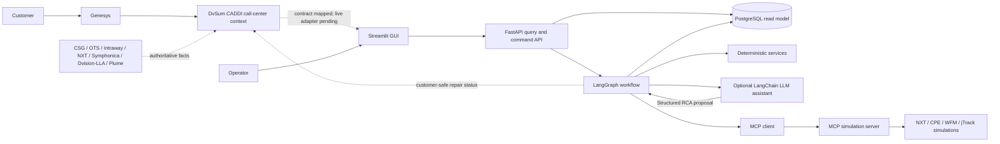

# LPR CPE Service Assurance Demo — v1.2 improved

A Docker Desktop demonstration of an HFC/PON customer-premises-equipment service-assurance workflow. It combines:

- deterministic event validation, correlation, policy checks, retry limits, and restoration verification;
- LangGraph orchestration with one incident state carried through the workflow;
- optional LangChain-backed OpenAI or Anthropic RCA assistance;
- human approval for RCA disagreement, remote actions, dispatch, Clean/Dirty Boots handover, and plant actions;
- a Streamlit operations cockpit, incident workbench, human decision center, decision/model monitor, and system monitor;
- an explicit DvSum CADDI/Genesys call-center correlation contract that preserves source-system authority without claiming a live adapter;
- a shared measurement contract that reconciles population, grain, window, provenance and completeness across Executive, Predictive/Care and Operations views;
- a strict, stateless MCP simulation endpoint for NXT, CPE, WFM, Clean Boots, jTrack MR, and plant actions;
- PostgreSQL for the queryable incident and approval read model;
- persistent idempotency and approval-consumption records for simulated MCP effects.

> **Simulation only.** No production system is connected and production writes are disabled by default.

## Current release: v1.27.14

The current application release uses **DvSum CADDI** as the canonical analytics/context product name, targets Python 3.14.7, and requires current Digital Twin runs to identify the `lpr-digital-twin-run-v3-execution-economics` schema. See [`docs/RELEASE_v1.27.14.md`](docs/RELEASE_v1.27.14.md) and [`docs/CURRENT_SCHEMA_RUN_RECOVERY.md`](docs/CURRENT_SCHEMA_RUN_RECOVERY.md).


## Three-wave remediation

Wave 1 now protects cost and dispatch output with catalog-hash, row-count and
canonical-join verification and separates generated execution economics from
planning-route forecasts. Waves 2 and 3 remain blocked pending sign-off. See
[`docs/OPEN_ISSUES_THREE_WAVES.md`](docs/OPEN_ISSUES_THREE_WAVES.md) and
[`docs/WAVE_1_COST_DATA_INTEGRITY.md`](docs/WAVE_1_COST_DATA_INTEGRITY.md).

## 24-Hour Install Assurance Watch

Stage 3 adds supervised new-install assurance as an **assurance episode**, not a
fault incident. Healthy HFC and PON installations complete a minimum 24-hour
watch without inflating break/fix counts. Persistent defects are promoted once
to a root incident, while Genesys contacts attach to the existing episode and
DvSum CADDI receives a customer-safe analytical projection. See
[`docs/INSTALL_ASSURANCE_WATCH.md`](docs/INSTALL_ASSURANCE_WATCH.md).


## Stage 2 — reconciled dashboard semantics

The legacy Control Tower, Digital Twin Predictive/Customer Care workspace and
Operations Cockpit now use one metric vocabulary and expose their measurement
context. The Digital Twin active run and live workflow repository remain separate
populations; the UI explains that difference instead of forcing their values to
match. Planning-model outputs are isolated from active-run evidence.

See [`docs/SHARED_MEASUREMENT_CONTRACT.md`](docs/SHARED_MEASUREMENT_CONTRACT.md).
The 24-Hour Install Assurance Watch is deliberately not included in this stage.


This revision compares the original bundle with `lpr-cpe-demo-fixed.zip` and adopts the stronger ideas without replacing the more complete, tested runtime. See [`docs/COMPARISON_AND_IMPROVEMENTS.md`](docs/COMPARISON_AND_IMPROVEMENTS.md).

## Quick start on Docker Desktop

### Prerequisites

- Docker Desktop with Docker Compose v2
- At least 4 GB free memory for Docker Desktop
- At least 5 GB free disk space
- Ports 5432, 8000, 8100, and 8501 available, or changed in `.env`

### First-build connectivity

The first build needs access to Docker images and the pinned Python packages. After the images are built, all default fake-model scenarios run locally without an external LLM account.

Corporate networks can provide a package mirror through `PIP_INDEX_URL`. Docker build proxy variables `HTTP_PROXY`, `HTTPS_PROXY` and `NO_PROXY` are forwarded from the host. TLS verification stays enabled.

Run the connectivity doctor before the first build:

```bash
./scripts/tls-doctor.sh
```

Windows PowerShell:

```powershell
.\scripts\tls-doctor.ps1
```

When an HTTPS-inspection proxy re-signs traffic, obtain the corporate root or issuing CA from IT/security and stage it for both images:

```bash
./scripts/stage-ca.sh /path/to/corporate-root.crt
```

```powershell
.\scripts\stage-ca.ps1 -CaFile C:\path\corporate-root.cer
```

Then rebuild with `docker compose build --no-cache`. Do not use `--trusted-host`, disable certificate verification, or stage a website leaf certificate. See [`docker/certs/README.md`](docker/certs/README.md).

### Start

PowerShell:

```powershell
Expand-Archive .\LPR_CPE_Service_Assurance_Demo_Bundle_v1_2_Improved.zip -DestinationPath .
cd .\LPR_CPE_Service_Assurance_Demo_Bundle_v1_2_Improved
.\scripts\start_demo.ps1
```

Bash:

```bash
unzip LPR_CPE_Service_Assurance_Demo_Bundle_v1_2_Improved.zip
cd LPR_CPE_Service_Assurance_Demo_Bundle_v1_2_Improved
./scripts/start_demo.sh
```

Direct Docker Compose command:

```bash
docker compose up --build -d
```

Open:

- Streamlit GUI: `http://localhost:8501`
- FastAPI documentation: `http://localhost:8000/docs`
- MCP simulator health: `http://localhost:8100/health`

### Validate the environment first

```bash
python scripts/check_environment.py
```

On Windows without a local Python installation:

```powershell
docker compose config
```

### Run the full Docker verification

Windows PowerShell:

```powershell
.\scripts\verify_docker.ps1
```

Bash:

```bash
./scripts/verify_docker.sh
```

This builds the images, starts PostgreSQL, MCP, FastAPI and Streamlit, checks all health endpoints, drives a live incident and approval through FastAPI to the MCP simulator, runs framework compatibility checks, exercises LangGraph interrupt/resume, executes the full scenario matrix, and runs the automated test suite with coverage.

Run only the test image:

```bash
docker compose --profile test build test
docker compose --profile test run --rm test
```

The container gate validates Compose, imports the pinned frameworks, runs real LangGraph and Streamlit runtime checks, executes all fixture scenarios, compiles the source, and runs the automated test suite with coverage. The complete verification scripts additionally exercise a live FastAPI-to-MCP incident and approval path.

### Optional low-resource mode

```bash
docker compose -f docker-compose.yml -f docker-compose.low-resource.yml up --build -d --wait
```

See `docs/OFFLINE_AND_LOW_RESOURCE.md` for offline-image export guidance.

### Stop

```bash
docker compose down
```

Remove the demo databases as well:

```bash
docker compose down -v
```

## Demonstration scenarios

| Scenario | Demonstrates |
|---|---|
| HFC remote reprovision succeeds | Deterministic and LLM-assisted RCA agree; human approves one remote action; verification closes the case without a truck roll. |
| Remote failure then Clean Boots | Failed remote action adds evidence and returns to RCA before a Clean Boots dispatch. |
| Guided self-help succeeds | Low-cost customer guidance and telemetry-based validation. |
| PON ODP handover | Clean Boots captures the ODP evidence package, then an approved jTrack MR transfers work to Dirty Boots. |
| Dirty-to-Clean reverse handover | Plant repair restores optics but the same incident returns to Clean Boots for a residual in-home fault. |
| HFC common cause | CPE alarms attach to a parent incident and avoid individual customer-premises dispatch. |
| Failed plant action and re-RCA | The first Dirty Boots repair fails, new evidence returns the case to RCA, and the same jTrack MR is updated for a second targeted attempt. |
| RCA disagreement gate | High confidence does not bypass human review when deterministic and LLM responsibility domains disagree. |
| Bounded remote failure | Two unsuccessful remote actions escalate rather than looping indefinitely. |

## Human decision flow

The GUI exposes pending decisions in **Decision Center**. A reviewer can:

- approve the recommendation;
- override with one of the reviewed options;
- request more evidence;
- reject and escalate.

The demo enforces role checks for each approval kind. Override, rejection, and request-more decisions require a rationale. Selecting a next-best action returns through policy and creates a fresh approval; an approval token for one action can never authorize another action.

## Deterministic and LLM responsibilities

Deterministic code owns:

- signal quality and common-cause correlation;
- evidence freshness and attempt budgets;
- responsibility-domain agreement gate;
- policy authorization and role requirements;
- idempotency, dispatch/action limits, and verification;
- KPI counts and terminal-state decisions.

The optional LLM assists with:

- evidence synthesis;
- ranked RCA hypotheses;
- concise rationale;
- explanation of the best and next-best action.

The LLM does not receive side-effecting tools. LangGraph invokes all MCP read and write tools, and every write requires an approved, signed action token.

## Enabling an external LLM

The default is deterministic fake-model mode, which needs no API key.

OpenAI-compatible provider:

```dotenv
MODEL_PROVIDER=openai
MODEL_NAME=<a model available in your account>
OPENAI_API_KEY=<key>
```

Anthropic provider:

```dotenv
MODEL_PROVIDER=anthropic
MODEL_NAME=<a model available in your account>
ANTHROPIC_API_KEY=<key>
```

Then restart:

```bash
docker compose up --build -d
```

The backend uses LangChain chat-model integrations and validates structured RCA output. In the default safe profile the fake assistant is used. For external providers, initialization failures fall back to the deterministic assistant only when explicitly permitted by configuration; the active provider and engine are shown in the System Monitor.

## DvSum CADDI / Genesys call-center layer

DvSum CADDI is represented explicitly as the existing LPR call-center correlation and
presentation layer integrated with Genesys. It is **not** treated as a replacement
system of record. CSG, OTS, Intraway, CommScope ServAssure NXT, Symphonica,
Dvision/LLA, Plume and the operational repair systems remain authoritative for the
facts they originate.

This release exposes a contract-only DvSum CADDI source map in both APIs and the UI. No
live DvSum CADDI endpoint, credentials or source data are connected. Maintenance and
repair remain in the Operations/VPTO workflow; DvSum CADDI receives a customer-safe status
projection in the target architecture. See
[`docs/DVSUM_CADDI_INTEGRATION_CONTRACT.md`](docs/DVSUM_CADDI_INTEGRATION_CONTRACT.md).

## Architecture



See `docs/ARCHITECTURE.md` and `docs/WORKFLOW.md` for implementation detail.

## Safety properties demonstrated

1. One incident and one SLA clock across remote, field, MR, and reverse-handover steps.
2. Deterministic-versus-LLM domain disagreement always forces human review.
3. Approval preparation, human decision, and effect execution are separate stages.
4. Simulated effects use restart-stable idempotency keys derived from incident, action, attempt and tap/ODP delimiter.
5. A consumed approval cannot authorize a different effect.
6. Failed work returns to RCA with new evidence.
7. Retry budgets stop infinite loops.
8. HFC tap and PON ODP handovers retain the original incident.
9. A command acknowledgement is separate from restoration verification.
10. Closure occurs only after validation and record reconciliation.
11. Common-cause children use the parent deadline while preserving their original clock.
12. The configured MCP profile is verified against the server before workflow startup.
13. Evidence, action, work-order, MR and timeline histories suppress identical replays while preserving later revisions.

## Repository layout

```text
docker/
  app.Dockerfile       API/UI/workflow image with corporate-CA support
  mcp.Dockerfile       Smaller MCP simulator image
  certs/               Optional corporate CA trust anchors
src/lpr_cpe_demo/
  api/                 FastAPI endpoints
  controls.py          Stable action/approval keys and SLA authority rules
  domain.py            Typed workflow and decision contracts
  llm/                 Fake and LangChain-backed RCA assistants
  mcp_client/          Strict MCP HTTP and in-process clients
  mcp_server/          Stateless simulation server and idempotent tools
  persistence/         PostgreSQL/SQLite operational read model
  ui/                  Streamlit multipage console and model/decision monitor
  workflow/            Portable logic and LangGraph wrapper
  fixtures/            Deterministic HFC/PON scenarios
scripts/               Environment, start, stop, test, and smoke-test helpers
tests/                 Workflow, API, MCP-control, and bundle tests
docs/                  Architecture, workflow, controls, and test report
```

## Test pipeline included in the bundle

The Docker test image runs:

1. Compose structure and healthcheck validation.
2. Python bytecode compilation for source, tests and scripts.
3. Installed-framework API checks for Streamlit, LangChain, LangGraph, the PostgreSQL checkpointer and the configured MCP package.
4. Exact runtime-version verification of the separate MCP service image through its health endpoint.
5. An actual LangGraph in-memory interrupt/resume workflow smoke test.
6. A Streamlit server startup and health test.
7. A live FastAPI-to-MCP incident creation, approval, execution, verification, and closure smoke test.
8. The complete nine-scenario deterministic matrix.
9. A PostgreSQL-backed LangGraph restart/resume check in the full Docker verification.
10. Pytest with an 80% coverage floor, including replay-safe history, stable-key, SLA-authority, CA-support and safe-action-override tests.

The full `verify_docker` scripts also run a live HTTP workflow smoke test against the started API and MCP services.

The packaging report in `BUILD_TEST_REPORT.txt` distinguishes tests executed in the build environment from Docker-only checks that must run on the target laptop. This revision passed 35 local tests with 84.63% measured coverage.

## Known demonstration limits

- CommScope NXT, CPE management, WFM, inventory, GIS, TM Forum records, and jTrack are simulated fixtures.
- The MCP server uses the `custom_stateless_2026` compatibility profile. It is stateless at the protocol layer; its effect/idempotency database is a local simulation store.
- The Streamlit role picker is mock authentication, not enterprise identity.
- Dispatch ranking is fixture-driven; a production build should bind a deterministic scheduling optimizer.
- The default Docker profile uses a PostgreSQL LangGraph checkpointer and a separate SQL operational read model. The portable workflow engine remains available for deterministic unit tests and environments where LangGraph is intentionally disabled.
- No production write can be enabled merely by editing the GUI; the backend remains in simulation mode unless both production settings are deliberately changed and real adapters are implemented.

## External CSV evidence and triangulation

The **External Evidence** workspace imports UTF-8 CSV exports from NXT, DvSum CADDI,
Genesys, JTrack and an installation/identity source. It validates identity, timestamps,
lifecycle and lineage; quarantines inconsistent rows; and presents deterministic and
optional LLM-assisted triangulation beside advisory action recommendations. Imported
scenarios are read-only child artifacts and never write to production systems. See
`docs/EXTERNAL_EVIDENCE_CSV.md` and `reference/external_evidence_examples/`.

All analytical workspaces use one uniform medium-grey panel system (`#4B5057`) with
consistent borders, 14-pixel radii, padding and text hierarchy. The legacy Control
Tower retains its dark page canvas while using the same panel surface as the other
views.
## Demo-derived cost and dispatch

The **Cost Simulator** and **Footprint & Dispatch** pages now default to the
persisted active Digital Twin run. Generated service/case/incident identity, RCA,
action status, work-order skill/parts/timestamps, JTrack MR and validation records
feed one complete dispatch/cost projection. Generated readiness codes are mapped
explicitly to the planning hub skill/stock vocabulary. Geography and hub selection remain a
deterministic planning mapping because the synthetic subscriber master contains no
surveyed coordinates. The generated planning region is now a serving-delimiter
property: every service behind one TAP or ODP shares one region, and legacy
mixed-region runs are rejected by the cost/dispatch projection until regenerated.
Economic rates remain explicit assumptions. Generated
execution and governed forecast costs are shown separately. The former seeded
fault simulator and manual site check remain available as planning-only modes. See
`docs/DEMO_DERIVED_COST_DISPATCH.md`.
