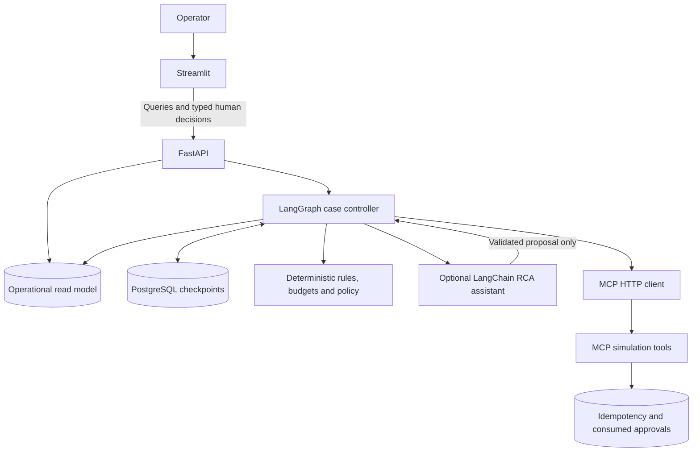
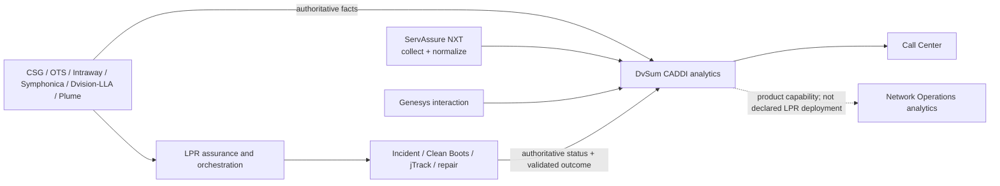

# Architecture

## Container footprint

| Service | Port | Purpose |
|---|---:|---|
| `ui` | 8501 | Streamlit cockpit, incident workbench, decisions and monitoring |
| `api` | 8000 | FastAPI query/command layer and LangGraph runtime |
| `mcp-sim` | 8100 | Strict stateless MCP simulation endpoint |
| `postgres` | 5432 | Operational read model and LangGraph checkpoints |
| `test` | profile only | Reproducible framework, workflow and coverage gate |

The API and UI share the app image. The MCP simulator has a smaller purpose-specific image. Both images support staged corporate CAs.

## Responsibility separation



- Streamlit never queries checkpoint tables.
- The model receives a compact evidence packet and never executes tools.
- LangGraph selects every read or write tool call.
- Every side effect is simulated and requires a matching signed approval token.
- PostgreSQL holds two different concerns: durable graph checkpoints and a queryable operational read model.
- The MCP effect store is separate because checkpoint replay safety does not itself deduplicate an external effect.

## Workflow runtime

The portable workflow engine is the single source for process-step logic. The LangGraph wrapper adds:

- one thread per incident;
- durable checkpoints;
- conditional transitions;
- a dedicated exactly-one-interrupt approval node;
- same-thread resume after a human decision.

Effect execution occurs only after the approval node resumes and routes to the next process step. The full Docker verification recreates the workflow service while an incident is paused, then resumes it from the PostgreSQL checkpointer.

## Replay and history controls

Three layers address different replay risks:

1. **Graph state replay:** deterministic event/action identifiers and replay-safe append methods suppress identical evidence, timeline and action records.
2. **Operational read model:** stable incident, approval and idempotency identifiers upsert rather than create random duplicates.
3. **External-effect boundary:** the MCP effect store returns the prior result for the same idempotency key and rejects reuse of a consumed approval for another key.

Work-order and MR collections preserve later status revisions while dropping an identical repeated revision.

## MCP compatibility profile

The mockup uses an explicit compatibility profile:

```text
MCP_PROFILE=custom_stateless_2026
MCP_PROTOCOL_VERSION=2026-07-28
MCP_STRICT_VERSION=true
```

The API checks the MCP `/health` response before workflow startup and fails on profile, protocol-version or statelessness mismatch. The custom implementation exposes only the tool-list and tool-call subset required by the demonstration.

## DvSum CADDI analytics boundary

DvSum CADDI is an AI analytics and correlation product for Call Center and
Network Operations. The declared LPR deployment remains Call Center-facing through
Genesys; this bundle does not claim that CADDI is deployed into Chuck/VPTO or owns
maintenance and repair. ServAssure NXT supplies and normalizes key network and
subscriber performance evidence for CADDI analysis. The relationship is represented
as a contract only; no live CADDI client or source-data connection is claimed.



The originating systems remain authoritative for their facts. DvSum CADDI is
authoritative only for its own analytical record. The LPR operational workflow
remains authoritative for incident, work-order, MR, maintenance, repair and
validated closure state. The preferred target is to augment or federate with DvSum
CADDI before considering selective replacement. See
`docs/DVSUM_CADDI_INTEGRATION_CONTRACT.md`.

## LPR data represented by fixtures

- CommScope ServAssure NXT alarm and health evidence
- HFC DOCSIS/PNM and shared-node context
- PON OLT/ONT optical evidence and ODP topology
- customer, CPE and Wi-Fi context
- customer ticket and prior-incident context
- Clean Boots measurements, photos and delimiter findings
- WFM work orders and jTrack MR lifecycle
- Dirty Boots/plant actions and post-fix validation

## Operational boundary

- HFC delimiter: tap
- PON delimiter: ODP
- Clean Boots: CPE, Wi-Fi, premise wiring and customer-side/drop work
- Dirty Boots: access network, distribution/feeder, OLT/node and plant-side work
- Joint: cases where both responsibility domains are implicated
- Reverse handover: same incident, evidence contract, attempt history and SLA clock
