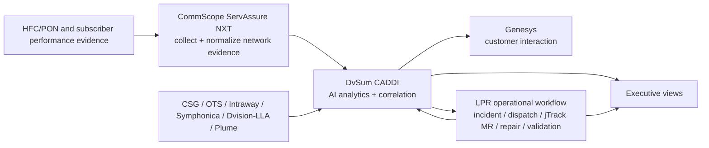

# DvSum CADDI integration contract

## Correction and scope

The product is **DvSum CADDI** — *Conversational Analytics for Data Driven
Insights* — not “CADI.” DvSum CADDI is an AI analytics and correlation product
for both **Call Center and Network Operations**. The stakeholder-supplied LPR
deployment remains **Call Center-facing through Genesys** and is not claimed as a
Chuck/VPTO maintenance-and-repair deployment. CommScope ServAssure NXT is an
important collection and normalization layer for network and subscriber evidence.

This Stage 1 amendment corrects nomenclature and product positioning only. It does
not introduce the Stage 2 shared measurement model or the Stage 3 24-Hour Install
Assurance Watch.

## What is externally verified

CommScope and DvSum publicly describe:

- **ServAssure NXT AI powered by DvSum**;
- DvSum CADDI as self-service analytics for Call Center and Network Operations;
- ServAssure NXT collecting and normalizing network and subscriber performance
  information;
- CADDI analyzing that information for customer-experience and network-health
  insight;
- advanced triage, proactive analytics, network optimization and fault management;
- DvSum customer-experience capabilities with Genesys Engage integration.

The LPR-specific source map below remains stakeholder supplied and requires joint
technical discovery before a live adapter is claimed.

## Declared LPR current-state capability map

| Capability | Authoritative source(s) | DvSum CADDI role | Product applicability | Declared LPR consumer | Status |
|---|---|---|---|---|---|
| Billing and account context | CSG | Analyze and present customer/account context | Call Center | Call Center | Declared existing |
| Outage and PNM context | OTS | Correlate contacts and network symptoms to outage/PNM context | Call Center; Network Operations | Call Center | Declared existing |
| HFC or FTTH device offline | Intraway HFC, ServAssure NXT, Symphonica FTTH | Analyze registration/offline context | Call Center; Network Operations | Call Center | Declared existing |
| Node outage and maintenance | NEXT/Dvision real-time, LLA seven-day history | Analyze current and recent serving-area context | Call Center; Network Operations | Call Center | Declared existing |
| Premise and modem history | Dvision real-time, LLA seven-day history | Analyze subscriber/modem history | Call Center; Network Operations | Call Center | Declared existing |
| Provisioning and cross-service diagnosis | Intraway, Symphonica FTTH | Identify provisioning/service-path causes | Call Center; Network Operations | Call Center | Declared existing |
| In-home Wi-Fi | Plume | Target analytical input; not currently in declared LPR CADDI scope | Call Center; Network Operations | Call Center | Known gap |
| Customer interaction | Genesys | Provide network-aware subscriber context and guidance | Call Center | Call Center | Declared existing |
| Maintenance and repair | Operational workflow, jTrack, ServAssure NXT/service validation | Analyze and present status; do not replace execution systems | Call Center; Network Operations | Call Center status view only | Explicit authority boundary |

`NEXT/Dvision` is retained from the stakeholder terminology. Exact product names,
ownership, APIs and relationships to ServAssure NXT must be confirmed.

## Corrected logical architecture



The diagram is a target responsibility model, not a statement that all interfaces
are currently connected.

## Source-of-truth policy

1. **CSG** remains authoritative for billing and account state.
2. **OTS** remains authoritative for the outage/PNM facts it publishes.
3. **Intraway, ServAssure NXT and Symphonica** remain authoritative for their
   respective provisioning and assurance observations.
4. **Dvision/NEXT and LLA** remain authoritative for the live and historical
   context they originate.
5. **Plume** would remain authoritative for Wi-Fi telemetry when connected.
6. **Genesys** remains authoritative for the customer interaction record.
7. **The LPR operational workflow, work-order systems and jTrack** remain
   authoritative for incident, dispatch, maintenance, repair and MR lifecycle.
8. **ServAssure NXT and service tests** remain authoritative evidence for
   restoration validation.
9. **DvSum CADDI is authoritative only for its analytical record**, not for the
   underlying billing, outage, provisioning or repair state.
10. Source disagreement must be visible; neither CADDI nor the LPR assurance layer
    may silently overwrite an originating fact.

## Analytical lineage contract

Every DvSum CADDI-derived insight should eventually carry:

```text
analytical_record_id
underlying_source_systems
source_record_ids
observed_at
analyzed_at
freshness_status
confidence
recommended_action
authoritative_status_source
```

This separates four things that must not be collapsed:

```text
source-system fact
→ DvSum CADDI analytical conclusion
→ LPR deterministic operating decision
→ executed action and validated outcome
```

## Target identity chain

```text
customer_id
billing_account_id
service_id
device_id / serial_number / MAC
technology
node_id or OLT/port
tap_id or ODP_id
dvsum_caddi_analytical_record_id
genesys_interaction_id
assurance_episode_id (future Stage 3)
root_incident_id
care_ticket_id
work_order_id
mr_id
```

## Operating boundary

DvSum CADDI's product scope may support both Call Center and Network Operations
analytics. The declared LPR deployment remains Call Center/Genesys-facing. The LPR
operational workflow remains responsible for:

- canonical root incidents and operational ownership;
- deterministic controls, approvals and remote actions;
- Clean Boots dispatch and evidence;
- HFC tap / PON ODP handoff;
- jTrack MR acceptance, repair and completion;
- maintenance and repair lifecycle;
- objective validation and closure.

CADDI and Genesys may receive a customer-safe projection such as current owner,
current state, next update, repair in progress and restored under observation. This
is a proposed integration, not a claim that Chuck/VPTO currently consumes CADDI.
CADDI must not become an undocumented execution or closure system.

## Discovery gate before a live adapter

A live DvSum CADDI adapter requires answers to the following:

- Is LPR using standalone DvSum CADDI, ServAssure NXT AI powered by DvSum, or a
  contractor-specific deployment pattern?
- What APIs, events, database views or embedded interfaces are available?
- Which identifiers are authoritative for customer, service, device and network
  element matching?
- What is the source precedence when inputs disagree?
- What are the latency and stale-data guarantees for each source?
- Can analytical conclusions expose underlying evidence and confidence?
- Can CADDI accept an assurance episode, root incident, work-order and MR reference?
- Can Genesys display work already in progress and the next committed update?
- What recommendation or write-back functions are available, and what approvals
  govern them?
- What is owned by LPR, DvSum, CommScope and the current contractor?
- Why do Maintenance and Repair stakeholders report that the current capability is
  not helping, and is the issue data, workflow, usability or ownership?
- Is missing Wi-Fi context best integrated through one shared Plume adapter?

## Compatibility policy

The canonical names are:

```text
Python module: lpr_cpe_demo.caddi
API route:     /api/integrations/caddi
UI view:       digital-twin?view=caddi
```

The old `lpr_cpe_demo.cadi` module, `/api/integrations/cadi` route and `view=cadi`
query remain as deprecated compatibility aliases for existing Stage 1 consumers.

## Stage boundary

This amended Stage 1 provides:

- corrected DvSum CADDI naming and product role;
- an executable product, capability and authority contract;
- canonical and backward-compatible API routes;
- explicit DvSum CADDI, Genesys and ServAssure NXT presentation in the Executive,
  Care, legacy Control Tower and Operations views;
- a blocked data-contract work item for a future live adapter;
- tests that prevent CADDI analytics from being represented as authoritative
  billing, outage, incident, repair or closure state.

It does **not** provide:

- a live DvSum CADDI or Genesys client;
- source-system credentials or data;
- metric reconciliation between the panels (Stage 2);
- the 24-Hour Install Assurance Watch (Stage 3);
- a decision to replace DvSum CADDI.

## Public product references

- CommScope strategic alliance announcement, 22 July 2025:
  `https://www.businesswire.com/news/home/20250722139498/`
- DvSum product site:
  `https://www.dvsum.ai/`
