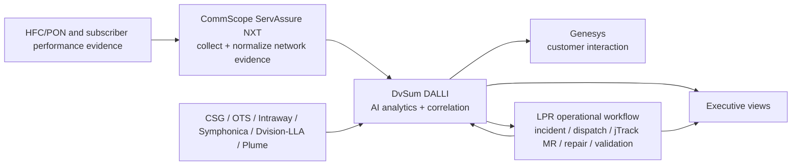

# DvSum DALLI integration contract


> Naming basis: **DvSum DALLI** is the project-facing label requested for the LPR demo.
> This contract does not assert an acronym expansion. The former CADDI/CADI spellings
> remain compatibility aliases only.
## Correction and scope

The LPR project-facing name is **DvSum DALLI**. DvSum DALLI is an AI analytics and correlation product
for both **Call Center and Network Operations**. The stakeholder-supplied LPR
deployment remains **Call Center-facing through Genesys** and is not claimed as a
Chuck/VPTO maintenance-and-repair deployment. CommScope ServAssure NXT is an
important collection and normalization layer for network and subscriber evidence.

This naming amendment changes nomenclature and compatibility surfaces only. It does
not alter the Stage 2 shared-measurement results or the Stage 3 24-Hour Install
Assurance Watch behavior.

## Naming and external-reference boundary

The **project-facing LPR display name is DvSum DALLI**, following the requested
nomenclature for this demo. Public DvSum material available during the review uses
the spelling **DvSum CADDI**. The application therefore treats CADDI/CADI as
compatibility aliases while presenting DvSum DALLI in panels, APIs and generated
install-assurance context.

The source review supports the product role—analytics and correlation for customer
experience and network operations, with Genesys and network-data integration—but it
does not support an acronym expansion for DALLI. No expansion is asserted here.

## Declared LPR current-state capability map

| Capability | Authoritative source(s) | DvSum DALLI role | Product applicability | Declared LPR consumer | Status |
|---|---|---|---|---|---|
| Billing and account context | CSG | Analyze and present customer/account context | Call Center | Call Center | Declared existing |
| Outage and PNM context | OTS | Correlate contacts and network symptoms to outage/PNM context | Call Center; Network Operations | Call Center | Declared existing |
| HFC or FTTH device offline | Intraway HFC, ServAssure NXT, Symphonica FTTH | Analyze registration/offline context | Call Center; Network Operations | Call Center | Declared existing |
| Node outage and maintenance | NEXT/Dvision real-time, LLA seven-day history | Analyze current and recent serving-area context | Call Center; Network Operations | Call Center | Declared existing |
| Premise and modem history | Dvision real-time, LLA seven-day history | Analyze subscriber/modem history | Call Center; Network Operations | Call Center | Declared existing |
| Provisioning and cross-service diagnosis | Intraway, Symphonica FTTH | Identify provisioning/service-path causes | Call Center; Network Operations | Call Center | Declared existing |
| In-home Wi-Fi | Plume | Target analytical input; not currently in declared LPR DALLI scope | Call Center; Network Operations | Call Center | Known gap |
| Customer interaction | Genesys | Provide network-aware subscriber context and guidance | Call Center | Call Center | Declared existing |
| Maintenance and repair | Operational workflow, jTrack, ServAssure NXT/service validation | Analyze and present status; do not replace execution systems | Call Center; Network Operations | Call Center status view only | Explicit authority boundary |

`NEXT/Dvision` is retained from the stakeholder terminology. Exact product names,
ownership, APIs and relationships to ServAssure NXT must be confirmed.

## Corrected logical architecture



The diagram is a target responsibility model, not a statement that all interfaces
are currently connected.

## Source-of-truth policy

DvSum DALLI must not become a second source of truth. It provides analytical context while the originating systems retain authority.

1. **CSG** remains authoritative for billing and account state.
2. **OTS** remains authoritative for the outage/PNM facts it publishes.
3. **Intraway, ServAssure NXT and Symphonica** remain authoritative for their
   respective provisioning and assurance observations.
4. **Dvision/NEXT and LLA** remain authoritative for the live and historical
   context they originate.
5. **Plume** would remain authoritative for Wi-Fi telemetry when connected.
6. **Genesys** remains authoritative for the customer interaction record.
7. **The LPR operational workflow, work-order systems and jTrack** remain
   authoritative for incident, dispatch, maintenance, repair and MR lifecycle.
8. **ServAssure NXT and service tests** remain authoritative evidence for
   restoration validation.
9. **DvSum DALLI is authoritative only for its analytical record**, not for the
   underlying billing, outage, provisioning or repair state.
10. Source disagreement must be visible; neither DALLI nor the LPR assurance layer
    may silently overwrite an originating fact.

## Analytical lineage contract

Every DvSum DALLI-derived insight should eventually carry:

```text
analytical_record_id
underlying_source_systems
source_record_ids
observed_at
analyzed_at
freshness_status
confidence
recommended_action
authoritative_status_source
```

This separates four things that must not be collapsed:

```text
source-system fact
→ DvSum DALLI analytical conclusion
→ LPR deterministic operating decision
→ executed action and validated outcome
```

## Target identity chain

```text
customer_id
billing_account_id
service_id
device_id / serial_number / MAC
technology
node_id or OLT/port
tap_id or ODP_id
dvsum_dalli_analytical_record_id
genesys_interaction_id
assurance_episode_id
root_incident_id
care_ticket_id
work_order_id
mr_id
```

## Operating boundary

DvSum DALLI's product scope may support both Call Center and Network Operations
analytics. The declared LPR deployment remains Call Center/Genesys-facing. The LPR
operational workflow remains responsible for:

- canonical root incidents and operational ownership;
- deterministic controls, approvals and remote actions;
- Clean Boots dispatch and evidence;
- HFC tap / PON ODP handoff;
- jTrack MR acceptance, repair and completion;
- maintenance and repair lifecycle;
- objective validation and closure.

DALLI and Genesys may receive a customer-safe projection such as current owner,
current state, next update, repair in progress and restored under observation. This
is a proposed integration, not a claim that Chuck/VPTO currently consumes DALLI.
DALLI must not become an undocumented execution or closure system.

## Discovery gate before a live adapter

A live DvSum DALLI adapter requires answers to the following:

- Is LPR using standalone DvSum DALLI, ServAssure NXT AI powered by DvSum, or a
  contractor-specific deployment pattern?
- What APIs, events, database views or embedded interfaces are available?
- Which identifiers are authoritative for customer, service, device and network
  element matching?
- What is the source precedence when inputs disagree?
- What are the latency and stale-data guarantees for each source?
- Can analytical conclusions expose underlying evidence and confidence?
- Can DALLI accept an assurance episode, root incident, work-order and MR reference?
- Can Genesys display work already in progress and the next committed update?
- What recommendation or write-back functions are available, and what approvals
  govern them?
- What is owned by LPR, DvSum, CommScope and the current contractor?
- Why do Maintenance and Repair stakeholders report that the current capability is
  not helping, and is the issue data, workflow, usability or ownership?
- Is missing Wi-Fi context best integrated through one shared Plume adapter?

## Compatibility policy

The canonical names are:

```text
Python module: lpr_cpe_demo.dalli
API route:     /api/integrations/dalli
UI view:       digital-twin?view=dalli
```

The old `lpr_cpe_demo.caddi` and `lpr_cpe_demo.cadi` modules, the
`/api/integrations/caddi` and `/api/integrations/cadi` routes, and the `view=caddi`
and `view=cadi` queries remain deprecated compatibility aliases.

## Release boundary

This amendment provides:

- the full DvSum DALLI label in Executive, Predictive/Care, Operations and
  Install Assurance panels;
- a canonical DALLI module, route and navigation view;
- backward-compatible CADDI/CADI import, API and query aliases;
- source-authority and analytical-lineage controls;
- DvSum DALLI/Genesys context for the 24-Hour Install Assurance Watch.

It does **not** provide:

- a live DvSum DALLI or Genesys client;
- source-system credentials or production data;
- a vendor API contract inferred without discovery;
- a decision to replace DvSum DALLI;
- any change to Stage 2 measurement formulas or Stage 3 assurance outcomes.

## Public product references

- CommScope strategic alliance announcement, 22 July 2025:
  `https://www.businesswire.com/news/home/20250722139498/`
- DvSum product site:
  `https://www.dvsum.ai/`

## Stage 3: 24-Hour Install Assurance Watch

The install-assurance episode remains authoritative in the LPR assurance layer.
DvSum DALLI receives an analytical/customer-safe projection for Genesys and does
not own incident execution or closure. The projection includes episode identity,
service/device identity, health, leading finding, actions already taken, current
owner, existing incident, work order/MR references and next update. No live
DALLI adapter is claimed by this demo.
