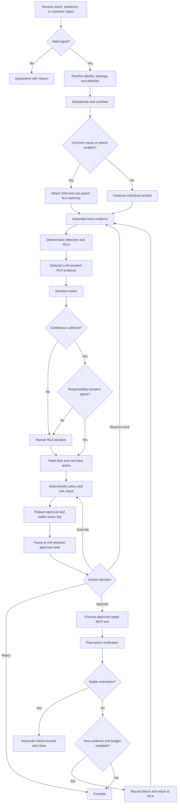

# Workflow

## End-to-end control flow

## Operating rules

1. **One incident and one durable thread.** Remote actions, customer self-help, Clean Boots, Dirty Boots, MRs and reverse handovers remain linked to the original incident.
2. **One clock.** A common-cause child preserves its own clock while the parent deadline becomes authoritative. Handover never resets the clock.
3. **Evidence before action.** Every action is tied to current evidence, an RCA result, a policy decision and a human approval when required.
4. **Deterministic controls remain authoritative.** Signal validation, topology, anomaly scores, confidence thresholds, policy, attempt budgets and restoration tests are not delegated to the LLM.
5. **The LLM proposes; the workflow executes.** Assisted RCA and action explanations use structured outputs. The model never receives side-effecting tools.
6. **Disagreement is a gate.** Different deterministic and assisted responsibility domains force human RCA review even when confidence is high.
7. **Approvals and effects are separate.** The approval node performs no external write. Execution occurs in a downstream node with a signed approval token.
8. **Replay is safe.** Action and approval identifiers are derived from incident, action, attempt and tap/ODP delimiter. Repeating the same key returns the stored effect.
9. **No blind repeat.** A failed action adds evidence and returns to RCA before another action or MR. Every loop is bounded.
10. **Proof before closure.** Action acknowledgement is not restoration. NXT/service validation and linked-record reconciliation must pass first.

## Resolution lanes

| Lane | Typical use | Human control | Typed execution |
|---|---|---|---|
| Remote reprovision/reboot | Reachable CPE with a reversible configuration/state issue | NOC or supervisor approval in the demo | `simulate_remote_action` |
| Guided self-help | Safe customer action with telemetry-based confirmation | NOC or supervisor approval | `simulate_self_help` |
| Clean Boots | CPE, Wi-Fi, premise wiring, drop or customer-side delimiter work | Dispatcher approval | `create_clean_boots_work_order` |
| Dirty Boots / jTrack MR | Fault accepted beyond HFC tap or PON ODP | Plant supervisor approval | `create_or_update_mr` |
| Joint dispatch | Evidence implicates both sides of the delimiter | Dispatcher approval | `simulate_joint_dispatch` |
| Plant/network action | Shared access-network or high-blast-radius issue | Operations supervisor approval | `simulate_plant_action` |
| Manual review | Low confidence, disagreement, exhausted budget or invalid state | L2/SME | No production-like tool |

## Handover behavior

### Clean Boots to Dirty Boots

A handover package carries:

- original incident and SLA clock;
- HFC tap or PON ODP identifier;
- topology and current owner;
- evidence and measurement references;
- last clean and first failed point;
- prior remote/self-help/field actions;
- fault-domain confidence;
- required skill, parts and access;
- existing outage/MR deduplication result.

The MR remains linked to the original incident. A failed plant action produces a new MR revision, not an unrelated incident or duplicate MR.

### Dirty Boots to Clean Boots

When plant telemetry is restored but customer service is still degraded, the same contract is applied in the reverse direction. The incident, SLA clock, work history and MR relationship remain intact.

## Replay-safe state history

The demo separates two different protections:

- **Effect idempotency:** the MCP effect store records each idempotency key and returns the stored result on replay.
- **State-history idempotency:** evidence, action history, timeline events, work-order revisions and MR revisions suppress identical replays while preserving later changed revisions.

The `hfc_failed_plant_action_rerca` scenario demonstrates two MR attempts with one stable MR identifier and two meaningful status/outcome revisions.

## Human approval roles

| Approval kind | Permitted roles |
|---|---|
| RCA review | L2/SME, operations supervisor |
| Remote action or self-help | NOC analyst, L2/SME, operations supervisor |
| Clean Boots or joint dispatch | Dispatcher, operations supervisor |
| Tap/ODP handover and MR | Plant supervisor, operations supervisor |
| High-blast-radius plant action | Operations supervisor |

An override, rejection or request for more evidence requires a reason. Selecting a different action consumes the original approval and returns through policy for a fresh approval.
