# Architecture — v2.4.0 P0 Fixed R3 Hotfix5

Hotfix5 keeps the R3 operating-control architecture and adds a first-class predictive-modem and Customer Care correlation plane. Production writes remain disabled.

```mermaid
flowchart LR
  CFG[Generation config] --> MASTER[Subscriber footprint]
  MASTER --> PULL[TR-069/TR-181 predictive modem pull]
  PULL --> PRED[Predictive scanner: forecast / proactive]
  MASTER --> CASE[Root incident + attempt graph]
  CASE --> PRE[Pre-action telemetry / NXT alarm / contact]
  PRED --> CORR[Service + device correlation]
  PRE --> CORR
  CORR --> CARE[Customer Care ticket]
  PRE --> DET[Deterministic RCA/policy]
  PRE --> LLM[LLM challenge or explicit unavailable/fake]
  DET --> REC[Recomputed reconciliation]
  LLM --> REC
  CARE --> REVIEW[Care review: deterministic + agent + predictive context]
  REC --> REVIEW
  REC --> HUMAN[Human/supervisor gate]
  REC --> AUTO[Policy auto only when safe]
  HUMAN --> READY[Diagnosis + skill + parts/CPE + access readiness]
  AUTO --> READY
  READY --> ACT[Simulated action]
  ACT --> BRANCH[Remote / Clean Boots / CPE swap / MR+Plant / evidence-only]
  BRANCH --> VERIFY[Objective evidence + checklist]
  VERIFY --> CLOSE[Root incident resolution]
  CLOSE --> CARECLOSE[Linked care-ticket closure]
```

## Predictive assurance plane

The integrated host repository already contains `lpr_cpe_demo.predictive`. Hotfix5's Digital Twin adapter uses that scanner when installed. The standalone release contains a compatible deterministic fallback so the bundle remains runnable by itself.

A predictive scan operates on service/device-correlated modem series and classifies:

- `proactive`: a modem KPI has already crossed an alarm threshold before the customer call;
- `forecast`: the fitted KPI trend reaches an alarm threshold inside the configured horizon while service still works.

Canonical generation writes a predictive snapshot. Additional operator-requested scans are stored under `RUN-.../predictive_scans/SCAN-...` as immutable child artifacts, so they do not mutate the parent run identity or catalog.

## Customer Care plane

Each synthetic contact is promoted to a `care_ticket`. The ticket stays on the canonical `root_incident_id`; it never creates a second incident. If a predictive ticket for the same `service_id` and `device_id` predates the contact, the care ticket is marked `ATTACH_TO_PREDICTIVE_ROOT_INCIDENT`. Otherwise it attaches to the existing reactive root incident.

`care_ticket_reviews` expose deterministic RCA, model/agent output, reconciliation state, predictive context, and evidence references in one record for operational review.

## DvSum CADDI analytics plane

DvSum CADDI is an AI analytics and correlation product for Call Center and
Network Operations. The stakeholder-supplied LPR deployment is explicitly narrower:
it remains Call Center-facing through Genesys and is not claimed as Chuck/VPTO's
maintenance-and-repair tool. CommScope ServAssure NXT collects and normalizes key
network and subscriber performance information that CADDI can analyze. The Digital
Twin does not claim a live CADDI connection. It exposes the contract so Customer
Care can build on the existing capability and Operations can remain a separate,
linked execution workflow rather than create a second truth.

CSG, OTS, Intraway, ServAssure NXT, Symphonica, Dvision/LLA, Plume and the
operational repair systems remain authoritative for the facts they originate.
The LPR operational workflow, Clean Boots, jTrack and validation remain
authoritative for incident, work and closure state. See
`../DVSUM_CADDI_INTEGRATION_CONTRACT.md`.

## Canonical graph and hard controls

Each attempt has a unique `case_id` but carries `root_case_id` and `root_incident_id`. Repeats keep the original root incident and service identity and require supervisor escalation. No repeat or Customer Care record creates a second incident.

The original gates remain non-bypassable: diagnosis/readiness before dispatch, skill/parts/access confirmation, failed CPE diagnostic before swap, evidence before MR acceptance/completion, and objective restoration plus checklist before closure.

## Quality/control plane

The fail-closed quality checker now runs 20 groups. In addition to the R3 graph, policy and closure invariants, it validates predictive pull-to-ticket evidence, care-to-root-incident attachment, predictive-before-contact causality, service-local correlation, and deterministic/agent/reconciliation consistency in the care review.

## Hotfix5.4 unified container topology

The host repository has one authoritative Compose project. PostgreSQL, MCP, the
main assurance API, `digital-twin-api`, and the main Streamlit UI share the
`lpr-demo` network. The Streamlit UI exposes Digital Twin / TAO as a normal page
and calls `http://digital-twin-api:8001` internally. Only one Streamlit port is
published by default: 8501. Digital Twin data remains isolated in the
`lpr-dt-data` volume and the Digital Twin API keeps its read-only root filesystem,
dropped Linux capabilities and production-write prohibition.
