# Architecture — v2.4.0 P0 Fixed R3

R3 separates the synthetic data plane, deterministic/model decision plane, policy recomputation, hard operating controls and durable human-decision state. Production writes remain disabled.

```mermaid
flowchart LR
  CFG[Generation config] --> MASTER[Subscriber footprint]
  MASTER --> CASE[Root incident + attempt graph]
  CASE --> PRE[Pre-action evidence]
  PRE --> DET[Deterministic RCA/policy]
  PRE --> LLM[LLM challenge or explicit unavailable/fake]
  DET --> REC[Recomputed reconciliation]
  LLM --> REC
  REC --> HUMAN[Human/supervisor gate]
  REC --> AUTO[Policy auto only when safe]
  HUMAN --> READY[Diagnosis + skill + parts/CPE + access readiness]
  AUTO --> READY
  READY --> ACT[Simulated action]
  ACT --> BRANCH[Remote / Clean Boots / CPE swap / MR+Plant / evidence-only]
  BRANCH --> VERIFY[Objective evidence + checklist]
  VERIFY --> CLOSE[Root incident resolution]
```

## Canonical graph

Each attempt has a unique `case_id` but carries `root_case_id` and `root_incident_id`. A repeat keeps the original root incident and service identity, links to the prior attempt, increments `repeat_sequence`, and requires supervisor escalation. No repeat row creates a second incident.

## Quality/control plane

The quality checker recomputes reconciliation from deterministic + agent facts and case-local evidence. Stored `human_review_required` flags cannot authorize themselves. Every service/incident/delimiter foreign key is validated against the root case and subscriber master.

## Action gates

- `remote_repair`: no truck roll; healthy post-fix telemetry -> validation/checklist -> resolution.
- `collect_evidence`: no truck roll and no false restoration.
- `dispatch_clean`: diagnosis/readiness -> assignment/dispatch -> Clean Boots evidence -> validation/checklist -> resolution.
- `cpe_swap`: readiness plus a separate failed CPE diagnostic before replacement starts -> replacement evidence -> validation/checklist -> resolution.
- `create_mr` / `plant_repair`: case-local tap/ODP + pre-existing evidence -> MR create/accept -> ready plant assignment -> repair/completion evidence -> validation/checklist -> resolution.

## Runtime hardening

Run generation uses a per-run lock and hidden staging directory; only a complete run with a catalog is atomically promoted. Incomplete run directories are rebuilt. Live approvals use atomic dataset replacement and update catalog hashes after quality passes.
