# Architecture — v2.4.0 Stage 2 semantic reconciliation

Stage 2 keeps the R3 operating controls and predictive/Customer Care plane while adding a canonical measurement projection. Production writes remain disabled.

```mermaid
flowchart LR
  CFG[Generation config] --> MASTER[Subscriber footprint]
  MASTER --> PULL[TR-069/TR-181 predictive modem pull]
  PULL --> PRED[Predictive scanner: forecast / proactive]
  MASTER --> CASE[Root incident + attempt graph]
  CASE --> PRE[Pre-action telemetry / NXT alarm / contact]
  PRED --> CORR[Service + device correlation]
  PRE --> CORR
  CORR --> CARE[Customer Care ticket]
  PRE --> DET[Deterministic RCA/policy]
  PRE --> LLM[LLM challenge or explicit unavailable/fake]
  DET --> REC[Recomputed reconciliation]
  LLM --> REC
  CARE --> REVIEW[Care review: deterministic + agent + predictive context]
  REC --> REVIEW
  REC --> HUMAN[Human/supervisor gate]
  REC --> AUTO[Policy auto only when safe]
  HUMAN --> READY[Diagnosis + skill + parts/CPE + access readiness]
  AUTO --> READY
  READY --> ACT[Simulated action]
  ACT --> BRANCH[Remote / Clean Boots / CPE swap / MR+Plant / evidence-only]
  BRANCH --> VERIFY[Objective evidence + checklist]
  VERIFY --> CLOSE[Root incident resolution]
  CLOSE --> CARECLOSE[Linked care-ticket closure]
```

## Predictive assurance plane

The integrated host repository already contains `lpr_cpe_demo.predictive`. Hotfix5's Digital Twin adapter uses that scanner when installed. The standalone release contains a compatible deterministic fallback so the bundle remains runnable by itself.

A predictive scan operates on service/device-correlated modem series and classifies:

- `proactive`: a modem KPI has already crossed an alarm threshold before the customer call;
- `forecast`: the fitted KPI trend reaches an alarm threshold inside the configured horizon while service still works.

Canonical generation writes a predictive snapshot. Additional operator-requested scans are stored under `RUN-.../predictive_scans/SCAN-...` as immutable child artifacts, so they do not mutate the parent run identity or catalog.

## Customer Care plane

Each synthetic contact is promoted to a `care_ticket`. The ticket stays on the canonical `root_incident_id`; it never creates a second incident. If a predictive ticket for the same `service_id` and `device_id` predates the contact, the care ticket is marked `ATTACH_TO_PREDICTIVE_ROOT_INCIDENT`. Otherwise it attaches to the existing reactive root incident.

`care_ticket_reviews` expose deterministic RCA, model/agent output, reconciliation state, predictive context, and evidence references in one record for operational review.

## CADI / Genesys call-center plane

CADI is declared as the existing LPR call-center correlation and presentation
layer integrated with Genesys. The Digital Twin does not claim a live CADI
connection. It exposes the contract so the Customer Care experience can be
designed to build on CADI rather than become a second source of truth.

CSG, OTS, Intraway, NXT, Symphonica, Dvision/LLA, Plume and operational
repair systems remain authoritative for the facts they originate. CADI is the
intended place to present a correlated customer-safe view. Operations, Clean
Boots, jTrack and validation remain responsible for incident, work and closure
state. See `../CADI_INTEGRATION_CONTRACT.md`.

## Shared measurement projection

`executive_projection.py` is now the authoritative active-run aggregate. It
calculates unique services, devices, contacts, case attempts and root incidents
from complete canonical datasets and emits a mutually exclusive root-status
partition. Dataset and queue pages expose pagination metadata but do not drive
headline metrics.

The main workflow API projects its repository through the same schema. It resolves
common-cause children through `parent_incident_id` and explicitly reports that the
live repository is not implicitly linked to the active Digital Twin run. The
legacy Control Tower consumes the active projection by default and keeps its seeded
fault generator in a separate Planning model mode.

See `../SHARED_MEASUREMENT_CONTRACT.md`.

## Canonical graph and hard controls

Each attempt has a unique `case_id` but carries `root_case_id` and `root_incident_id`. Repeats keep the original root incident and service identity and require supervisor escalation. No repeat or Customer Care record creates a second incident.

The original gates remain non-bypassable: diagnosis/readiness before dispatch, skill/parts/access confirmation, failed CPE diagnostic before swap, evidence before MR acceptance/completion, and objective restoration plus checklist before closure.

## Quality/control plane

The fail-closed quality checker now runs 20 groups. In addition to the R3 graph, policy and closure invariants, it validates predictive pull-to-ticket evidence, care-to-root-incident attachment, predictive-before-contact causality, service-local correlation, and deterministic/agent/reconciliation consistency in the care review.

## Hotfix5.4 unified container topology

The host repository has one authoritative Compose project. PostgreSQL, MCP, the
main assurance API, `digital-twin-api`, and the main Streamlit UI share the
`lpr-demo` network. The Streamlit UI exposes Digital Twin / TAO as a normal page
and calls `http://digital-twin-api:8001` internally. Only one Streamlit port is
published by default: 8501. Digital Twin data remains isolated in the
`lpr-dt-data` volume and the Digital Twin API keeps its read-only root filesystem,
dropped Linux capabilities and production-write prohibition.
