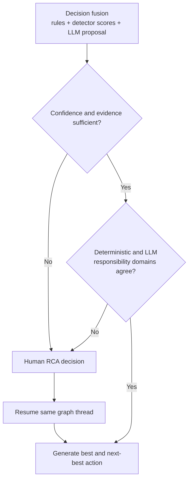

# CPE demo mockup — specification audit and proposed changes

**Subject:** Proposed LangGraph / MCP / Streamlit demonstration architecture for the LPR CPE incident-to-resolution workflow
**Audit date:** 12 August 2026
**Status:** Approve to build, conditional on SC-1 and SC-2

---

## 1. Scope and method

### 1.1 What was audited

The specification document describing the demo mockup: recommended architecture (§1), MCP and LLM separation (§2), the reduced workflow (§3), the deterministic / LLM-assisted / human split (§4), RCA design (§5), best and next-best action (§6), Streamlit GUI (§7), human approval implementation (§8), the MCP simulation server (§9), Docker Compose footprint (§10), repository structure (§11), the minimal API and read model (§12), scenarios (§13), mock labelling (§14), and definition of done (§15).

### 1.2 What was not available

The document references attachments that were not supplied: the existing implementation, its state model, detectors, policy engine, `compile_parent_graph()`, the `PENDING_STAGES` safeguards, and an engineering handover containing the three-to-four week estimate. **All statements in the specification about what already exists in the repository are taken on trust and are outside the boundary of this audit.**

### 1.3 What was verified externally

Two version-sensitive claims were checked against primary sources rather than accepted as written. Both are listed in Appendix A with fetch-verified URLs. One is confirmed with an important qualification the specification omits; the other is confirmed and turns out to be materially stricter than the specification assumes.

### 1.4 Severity definitions

| Severity | Meaning |
|---|---|
| **Blocking** | The demonstration misrepresents its own controls if shipped as designed. Fix before build. |
| **High** | Will surface during the build or during a live demo. Fix in the first iteration. |
| **Medium** | Design gap requiring a decision. Can be scheduled or explicitly descoped. |
| **Low** | Correctness or polish. Fix opportunistically. |

Severity is the auditor's assessment, not the specification author's.

---

## 2. Audit summary

### 2.1 Verdict

**The architecture is sound and proportionate, and should be built.** Four containers, a separate `demo_graph` reusing the deterministic services, simulated adapters, and a read model sitting beside the checkpointer rather than inside it. Nothing is over-built for a mockup, and the decision to leave the production graph and its `PENDING_STAGES` safeguards untouched is correct.

Two of its design choices are right and non-obvious, and should be preserved through any revision:

1. **The LLM provider is called directly rather than wrapped as an MCP tool.** MCP exposes tools, resources and prompts *to* an LLM application. Wrapping the provider adds a hop and degrades timeout, token, cost, model-version and retry telemetry.
2. **Read-only and side-effecting tools are separated, with execution tools hidden from the model.** The model may recommend a reboot; it cannot perform one. This is enforced structurally rather than by prompt, which is the only enforcement that survives contact with a demo audience.

**However, two defects allow the demonstration to misrepresent its own controls**, and both are cheap to fix. Neither requires a new container, service or dependency.

### 2.2 Findings

| # | Finding | Severity | Spec location | Change |
|---|---|---|---|---|
| F-1 | RCA domain disagreement is computed for display and never routed on | **Blocking** | §3, §5 | SC-1 |
| F-2 | Idempotency keys are declared on every execution tool but nothing stores them | **Blocking** | §9, §12 | SC-3, SC-4 |
| F-3 | Conditional interrupts inside a node break index-based resume matching | High | §8 | SC-2 |
| F-4 | `approval_id` is passed to execution tools but never verified | High | §9 | SC-3 |
| F-5 | The RCA return loop has no attempt cap | High | §3 | SC-5 |
| F-6 | The MCP revision cited is a breaking change, not a version bump | High | §2, §10 | SC-6 |
| F-7 | Common-cause attachment conflicts with the single-SLA-clock principle | Medium | §12, §13 | SC-4 |
| F-8 | Reverse handover (dirty back to clean) is absent | Medium | §13 | SC-9 |
| F-9 | No specified refresh path from the graph to Streamlit | Medium | §7 | SC-8 |
| F-10 | The architecture diagram contradicts the correction in §2 | Low | §1 | SC-10 |
| F-11 | `mcp-sim` has no healthcheck; `api` depends on `service_started` | Low | §10 | SC-7 |

---

## 3. Findings in detail

### F-1 — RCA domain disagreement is computed for display and never routed on

**Severity:** Blocking · **Location:** §3 (node `M`), §5 (GUI mock)

**Observation.** The workflow routes on a single condition: `M{Confidence and evidence sufficient?}`. The §5 GUI mock displays a deterministic result (`Drop / customer side of tap — 0.74`), an LLM proposal (`Drop impairment — 0.78`, `Tap-port impairment — 0.15`), and an explicit `Agreement — Same responsibility domain` line. The comparison is therefore already computed. It is presented to the operator and then discarded by the router.

**Impact.** Where the deterministic classifier and the LLM proposal name *different* responsibility domains but confidence sits above threshold, the graph proceeds directly to action generation with no human involvement. This is precisely the case where the model's judgement is load-bearing, and it is precisely the case the specification's own §4 table says should be `Approve/override`. As designed, the demonstration would show a governance control that does not exist.

**Required change.** SC-1. The cost is one edge condition; the comparison already exists.

---

### F-2 — Idempotency keys are declared but nothing stores them

**Severity:** Blocking · **Location:** §9 (tool signatures), §12 (read model)

**Observation.** Every side-effecting tool in §9 correctly accepts `idempotency_key` and `approval_id`. No component in §10, §11 or §12 stores consumed keys. The read model contains a single `incident_summary` table with no idempotency or approval tables.

**Evidence.** The LangGraph documentation is unambiguous on the mechanism that makes this dangerous: when execution resumes, *"the runtime restarts the entire node from the beginning — it does not resume from the exact line where `interrupt` was called. This means any code that ran before the `interrupt` will execute again."* The documentation's own worked example of the anti-pattern is creating a record before an interrupt, with the note that this *"will create duplicate records on each resume."*

**Impact.** §8 places the approval interrupt inside the workflow immediately before simulated execution. Any resume — including a demonstrator clicking approve twice, or a container restart — produces a second `create_work_order`. The audit trail on §15 item 13 then shows two work orders for one approval, in a demonstration whose entire premise is one incident with linked work orders.

**Required change.** SC-3 (tool-side dedupe) and SC-4 (storage). SC-2 reduces the exposure but does not remove it; the dedupe store is the actual control.

---

### F-3 — Conditional interrupts inside a node break index-based resume matching

**Severity:** High · **Location:** §8

**Observation.** §8 specifies interrupts at five points: low-confidence RCA, remote action, dispatch, clean-to-dirty handover, and exceptional closure. It does not specify whether these are separate nodes or conditional calls inside shared nodes.

**Evidence.** LangGraph matches resume values to interrupts **strictly by index** within a node, and the documentation explicitly lists *"do not conditionally skip `interrupt` calls within a node"* as a rule, because *"on first run, this might skip the interrupt; on resume, it might not skip it — causing index mismatch."* The documentation additionally warns against wrapping `interrupt()` in a bare `try/except`, because the pause is implemented as an exception and a bare handler swallows it.

**Impact.** The natural implementation of "interrupt only when confidence is low" is a conditional `interrupt()` inside the RCA node. That is the documented anti-pattern. The second risk is equally live: the demo will wrap MCP calls in error handling, and a bare `except` anywhere around an interrupt silently disables the pause.

**Required change.** SC-2.

---

### F-4 — `approval_id` is passed to execution tools but never verified

**Severity:** High · **Location:** §9

**Observation.** Execution tools accept `approval_id`. Nothing in the specification validates that the approval exists, belongs to this incident, authorises this action type, or has not already been consumed. §8 states that "FastAPI validates user and request", which covers the human decision but not the downstream tool call.

**Impact.** Hiding execution tools from the model removes the forgery threat, so this is not a security finding for a mockup. It is a *demonstration* finding: the approval gate cannot be shown to be load-bearing. An audience cannot distinguish a gate that blocks unauthorised execution from one that merely records a click.

**Required change.** SC-3. The demonstration value of a visible rejection is higher than that of another successful path — see the addition to §15.

---

### F-5 — The RCA return loop has no attempt cap

**Severity:** High · **Location:** §3 (`AB --> I`)

**Observation.** Failed post-action verification records the attempt and returns unconditionally to evidence assembly. §6 states the correct rule — *"Do not run a second reprovision without new evidence. Return to RCA"* — but as GUI copy, not as a graph condition. The read model already carries `remote_attempts` and `field_visits`; neither is wired to a routing decision.

**Impact.** A scenario that fails repeatedly loops without bound. In a live demonstration this is worse than a crash, because it looks like normal operation.

**Required change.** SC-5. The counters exist; only the condition is missing.

---

### F-6 — The MCP revision cited is a breaking change, not a version bump

**Severity:** High · **Location:** §2, §10

**Observation.** §2 cites the `2026-07-28` transport specification and specifies a Streamable HTTP endpoint at `http://mcp-sim:8100/mcp`. It does not mention that this revision is a breaking change.

**Evidence.** Verified against the specification release announcement. The revision retires the `initialize`/`initialized` exchange and the `Mcp-Session-Id` header; requires `Mcp-Method` and `Mcp-Name` headers on Streamable HTTP, with servers rejecting requests where headers and body disagree; deprecates roots, sampling and logging on a twelve-month window; and deprecates the legacy HTTP+SSE transport. All four Tier 1 SDKs speak the revision, but SDK betas negotiate down to `2025-11-25` unless the stateless mode is explicitly enabled.

**Impact.** Two concrete risks. First, a silent negotiation downgrade between the LangChain MCP adapter client and a freshly generated SDK server — the demo works, but not on the protocol version the specification claims. Second, any design that assumes a session handle in `mcp-sim` is building on a removed primitive.

**Note on MRTR.** The revision adds Multi Round-Trip Requests, where a server returns `resultType: "input_required"` and the client retries with answers attached. Several vendors use this for confirm-before-acting. **It is not a substitute for the §8 approval gate.** MRTR handles an in-call confirmation measured in seconds; the approval gate must survive a thread paused for hours, which is the checkpointer's responsibility. Both mechanisms may coexist; they solve different problems.

**Required change.** SC-6.

---

### F-7 — Common-cause attachment conflicts with the single-SLA-clock principle

**Severity:** Medium · **Location:** §12 (schema), §13 (Scenario D)

**Observation.** Scenario D attaches child incidents to a parent outage. `incident_summary` holds one `sla_deadline` per row and has no parent link. The specification does not state whose clock governs an attached child.

**Impact.** The demonstration asserts "one incident and one SLA clock" as a headline operating idea, and Scenario D is the scenario built to prove it. Without an explicit rule, the attached children either keep breaching against their own deadlines or silently lose their clocks, and the audience sees the principle break in the demonstration of the principle.

**Required change.** SC-4.

---

### F-8 — Reverse handover is absent

**Severity:** Medium · **Location:** §13 (Scenario C)

**Observation.** Scenario C runs clean boots → ODP handover → dirty boots → closure. The reverse direction is not represented: dirty boots restores the plant, service remains degraded in-home, and the work returns to clean boots.

**Impact.** The handover is presented as one-directional when the operating model is symmetric. The same contract and gate apply in both directions, so this is an omission rather than a design gap.

**Required change.** SC-9, or an explicit descoping statement in §14.

---

### F-9 — No specified refresh path from the graph to Streamlit

**Severity:** Medium · **Location:** §7, §15 item 2

**Observation.** §15 item 2 requires the user to "watch the workflow progress in Streamlit". No polling, push or refresh mechanism is specified anywhere in §7 or §12.

**Impact.** Without one, the operator must manually rerun the page to see state changes. The difference between a demonstration that feels live and one that requires the presenter to keep clicking is entirely this mechanism.

**Required change.** SC-8.

---

### F-10 — The architecture diagram contradicts the correction in §2

**Severity:** Low · **Location:** §1

**Observation.** The mermaid diagram contains `MODEL -->|Read-only tools| MCP`. Models do not call tools; they emit tool-call requests that the orchestrator executes.

**Impact.** Minor in isolation, but §2 exists specifically to correct this confusion, and the diagram is what most readers will retain.

**Required change.** SC-10.

---

### F-11 — `mcp-sim` has no healthcheck

**Severity:** Low · **Location:** §10

**Observation.** `postgres` has a healthcheck and `api` waits on `service_healthy`. `mcp-sim` has neither, and `api` depends on it with `condition: service_started`.

**Impact.** The API can accept traffic before the MCP server is listening. Flaky first run after `docker compose up --build`, which is the first thing anyone does.

**Required change.** SC-7.

---

## 4. Proposed specification changes

Each change is written to be lifted directly into the corresponding section of the specification.

### SC-1 — Add a domain-agreement gate to the router (§3, §5)

**Replace** the single routing condition in §3 with two sequential gates:



**Add** to §3 as a stated rule:

> Disagreement on the responsibility domain between the deterministic classifier and the LLM proposal forces the human RCA gate regardless of confidence. Confidence alone is never sufficient to bypass a human when the two methods disagree about where the fault lives.

**Add** to the demo state:

```python
rca_domain_deterministic: str
rca_domain_llm: str
domain_agreement: Literal["agree", "disagree"]
gate_reason: Literal["low_confidence", "domain_disagreement", "policy", "none"]
```

**Reference implementation:**

```python
RCA_CONFIDENCE_THRESHOLD = 0.70

def route_after_fusion(state: DemoState) -> Literal["human_rca", "generate_action"]:
    if state["rca_confidence"] < RCA_CONFIDENCE_THRESHOLD:
        return "human_rca"                      # gate_reason = low_confidence
    if state["rca_domain_deterministic"] != state["rca_domain_llm"]:
        return "human_rca"                      # gate_reason = domain_disagreement
    return "generate_action"
```

**Add** to the §4 table:

| Workflow function | Deterministic | LLM-assisted | Human |
|---|---:|---:|---:|
| RCA domain agreement check | Yes | No | Gate on disagreement |

The §5 GUI already renders the `Agreement` line. Add the gate outcome beneath it so the operator sees why they were asked:

```text
Agreement
Domains differ — deterministic: drop, LLM: hfc_tap

Gate result
Human decision required (reason: domain_disagreement)
```

---

### SC-2 — Specify interrupt and node discipline (§8)

**Add** to §8 as normative rules:

> **R1. One approval per node.** An approval node contains exactly one `interrupt()` call and performs no side effects.
>
> **R2. Never call `interrupt()` conditionally.** Branch with `add_conditional_edges` into a dedicated approval node. Resume values are matched to interrupts strictly by index within a node, so a conditionally skipped interrupt causes an index mismatch on resume.
>
> **R3. No side effects before `interrupt()`.** The node re-runs from the beginning on resume, so every line before the interrupt executes again. Pure computation before, side effects after — or in a downstream node.
>
> **R4. Never wrap `interrupt()` in a bare `try/except`.** The pause is implemented as an exception; a bare handler swallows it and the graph does not pause. Catch specific exception types only.
>
> **R5. Execution lives in its own node** downstream of the approval node, so that a replay of the approval node cannot re-fire the action.

**Reference pattern:**

```python
def build_dispatch_proposal(state: DemoState) -> dict:
    # Pure computation only. Safe to re-run.
    return {"proposal": compose_dispatch_requirement(state)}

def dispatch_approval_node(state: DemoState) -> dict:
    # Exactly one interrupt. No side effects. No try/except around it.
    decision = interrupt({
        "kind": "dispatch",
        "incident_id": state["incident_id"],
        "proposal": state["proposal"],
        "alternatives": state["next_best"],
        "policy_result": state["policy_result"],
        "sla_impact": state["sla_impact"],
    })
    return {"approval": decision}

def dispatch_execute_node(state: DemoState) -> dict:
    # All side effects live here, downstream of the approval.
    if state["approval"]["status"] != "approved":
        return {"lane": "cancelled", "gate_reason": "rejected"}
    result = mcp.create_clean_boots_work_order(
        incident_id=state["incident_id"],
        requirements=state["proposal"],
        idempotency_key=state["approval"]["idempotency_key"],
        approval_id=state["approval"]["approval_id"],
    )
    return {"work_orders": [result]}

builder.add_conditional_edges(
    "policy_check", needs_human_approval,
    {"yes": "dispatch_approval", "no": "dispatch_execute"},
)
builder.add_edge("dispatch_approval", "dispatch_execute")
```

The `idempotency_key` is minted with the `ApprovalRequest`, before the interrupt, and is therefore stable across replays. This is the property SC-3 depends on.

---

### SC-3 — Specify the execution tool contract (§9)

**Add** to §9 as a normative contract for every side-effecting tool:

> Every side-effecting MCP tool must, in this order:
> 1. Look up `idempotency_key` in the idempotency store. If present, return the stored result with `replayed: true` and perform no effect.
> 2. Validate `approval_id`: it exists, its `incident_id` matches, its `action_type` matches the tool, its status is `approved`, and it has not been consumed. Reject with a typed error otherwise.
> 3. Perform the simulated effect.
> 4. Record the result against `idempotency_key` and mark the approval consumed, in the same transaction as the effect.

**Reference implementation:**

```python
class ToolRejection(Exception):
    """Typed rejection the UI can render. Code is displayed to the operator."""

@mcp.tool()
async def create_clean_boots_work_order(
    incident_id: str,
    requirements: DispatchRequirement,
    idempotency_key: str,
    approval_id: str,
) -> WorkOrder:
    prior = await store.get_result(idempotency_key)
    if prior is not None:
        return WorkOrder(**prior, replayed=True)

    approval = await store.get_approval(approval_id)
    if approval is None:
        raise ToolRejection("APPROVAL_NOT_FOUND")
    if approval.status != "approved":
        raise ToolRejection("APPROVAL_NOT_GRANTED")
    if approval.incident_id != incident_id:
        raise ToolRejection("APPROVAL_INCIDENT_MISMATCH")
    if approval.action_type != "clean_boots":
        raise ToolRejection("APPROVAL_ACTION_MISMATCH")
    if approval.consumed_at is not None:
        raise ToolRejection("APPROVAL_ALREADY_CONSUMED")

    work_order = await simulate_work_order(incident_id, requirements)
    await store.commit_effect(
        idempotency_key=idempotency_key,
        approval_id=approval_id,
        tool_name="create_clean_boots_work_order",
        result=work_order.model_dump(),
    )
    return work_order
```

**Rejection codes** to surface on §7 page 5 and in the incident audit trail:

| Code | Meaning |
|---|---|
| `APPROVAL_NOT_FOUND` | No such approval |
| `APPROVAL_NOT_GRANTED` | Approval exists but is pending or rejected |
| `APPROVAL_INCIDENT_MISMATCH` | Approval belongs to a different incident |
| `APPROVAL_ACTION_MISMATCH` | Approval authorises a different action type |
| `APPROVAL_ALREADY_CONSUMED` | Approval has already been used |

---

### SC-4 — Extend the read model (§12)

**Replace** the single-table read model with the following:

```sql
ALTER TABLE incident_summary ADD COLUMN parent_incident_id        text NULL;
ALTER TABLE incident_summary ADD COLUMN sla_mode                  text NOT NULL DEFAULT 'own';
ALTER TABLE incident_summary ADD COLUMN rca_domain_deterministic  text NULL;
ALTER TABLE incident_summary ADD COLUMN rca_domain_llm            text NULL;
ALTER TABLE incident_summary ADD COLUMN domain_agreement          text NULL;
ALTER TABLE incident_summary ADD COLUMN gate_reason               text NULL;

CREATE TABLE approval (
    approval_id  text PRIMARY KEY,
    incident_id  text        NOT NULL,
    action_type  text        NOT NULL,
    status       text        NOT NULL,          -- pending | approved | rejected
    decided_by   text        NULL,
    reason       text        NULL,              -- mandatory on override or reject
    consumed_at  timestamptz NULL,
    created_at   timestamptz NOT NULL DEFAULT now()
);

CREATE TABLE idempotency_record (
    idempotency_key text PRIMARY KEY,
    incident_id     text        NOT NULL,
    tool_name       text        NOT NULL,
    approval_id     text        NULL,
    result_json     jsonb       NOT NULL,
    created_at      timestamptz NOT NULL DEFAULT now()
);
```

**Add** the SLA rule to §12 as normative text:

> `sla_mode` takes one of `own`, `inherits_parent`, or `paused`.
>
> A child incident attached to a parent under common-cause correlation sets `parent_incident_id` and `sla_mode = 'inherits_parent'`. While attached, the parent's deadline governs breach calculation and is the deadline displayed on the child. The child's own clock is neither restarted nor discarded at attach time. On detach, `sla_mode` returns to `own` and the original clock resumes from its original start.
>
> One incident retains one clock throughout. Attachment changes which clock is authoritative; it never creates a second one.

---

### SC-5 — Bound the RCA return loop (§3)

**Add** to §3 as a stated rule and routing condition:

> A return to RCA must carry at least one new evidence item relative to the previous attempt. Attempts are capped. Exceeding a cap routes to escalation, never back to RCA.

```python
MAX_REMOTE_ATTEMPTS = 2
MAX_FIELD_VISITS = 3

def route_after_verification(state: DemoState) -> str:
    if state["verification_passed"]:
        return "reconcile_and_close"
    if state["lane"] == "remote" and state["remote_attempts"] >= MAX_REMOTE_ATTEMPTS:
        return "escalate"
    if state["field_visits"] >= MAX_FIELD_VISITS:
        return "escalate"
    if not state["new_evidence_since_last_rca"]:
        return "escalate"
    return "assemble_evidence"
```

Both counters already exist in `incident_summary`.

---

### SC-6 — Pin the MCP protocol revision (§2, §10)

**Add** to §2:

> The `2026-07-28` revision is a breaking change, not an increment. It removes the `initialize`/`initialized` exchange and the `Mcp-Session-Id` header, requires `Mcp-Method` and `Mcp-Name` headers on Streamable HTTP with servers rejecting header/body disagreement, and deprecates roots, sampling and logging alongside the legacy HTTP+SSE transport.
>
> Consequences for this build:
> - `mcp-sim` must hold no per-session state. If a tool needs to carry state across calls, mint an explicit handle and return it as a tool argument.
> - The protocol revision is pinned on both client and server and mismatches fail fast. Silent negotiation down to `2025-11-25` is a defect, not a fallback.
> - MRTR `input_required` is not used for the §8 approval gate. Approvals must survive a paused thread; that is the checkpointer's responsibility.

**Add** to the `api` and `mcp-sim` environments in §10:

```yaml
      MCP_PROTOCOL_VERSION: "2026-07-28"
      MCP_STRICT_VERSION: "true"
```

**Add** to §15 as a pre-build check:

> Confirm the LangChain MCP adapters negotiate `2026-07-28` against the Python SDK server before the transport is wired. If they do not, pin both sides to `2025-11-25` deliberately and record the decision, rather than discovering the downgrade at demo time.

---

### SC-7 — Add a healthcheck to `mcp-sim` (§10)

```yaml
  mcp-sim:
    build:
      context: .
      dockerfile: docker/mcp.Dockerfile
    command: python -m lpr_demo.mcp_server
    environment:
      DEMO_SCENARIO_DIR: /app/fixtures
      MCP_PROTOCOL_VERSION: "2026-07-28"
    ports:
      - "8100:8100"
    healthcheck:
      test: ["CMD-SHELL", "curl -fsS http://localhost:8100/health || exit 1"]
      interval: 5s
      timeout: 5s
      retries: 10

  api:
    depends_on:
      postgres:
        condition: service_healthy
      mcp-sim:
        condition: service_healthy
```

---

### SC-8 — Specify the UI refresh mechanism (§7)

**Add** to §7:

> Pages that display live workflow state poll the read model on a fragment timer. The checkpointer is never queried from the UI.

```python
@st.fragment(run_every="2s")
def incident_queue() -> None:
    rows = api.get_incidents()
    st.dataframe(rows, selection_mode="single-row", on_select="rerun")

@st.fragment(run_every="2s")
def pending_decisions() -> None:
    st.metric("Awaiting decision", len(api.get_approvals(status="pending")))
```

Apply to page 2 (cockpit), page 3 (incident workbench stage strip) and page 4 (decision centre queue). Pages 1 and 5 do not need it.

---

### SC-9 — Add Scenario E, reverse handover (§13)

```text
Scenario E — Dirty back to clean

PON optical fault at the ODP
→ Dirty Boots repairs the ODP and validates optical levels
→ NXT confirms the optical path is restored
→ service still degraded: in-home Wi-Fi and CPE profile remain suspect
→ reverse handover package built (same contract, opposite direction)
→ supervisor approves
→ Clean Boots dispatched on the same incident and the same MR
→ verification passes
→ coordinated closure
```

Add the corresponding fixture:

```text
scenario_pon_reverse_handover.json
```

If reverse handover is descoped for the mockup, state that explicitly in §14 alongside the other mock-only shortcuts, rather than leaving it unmentioned.

---

### SC-10 — Correct the architecture diagram (§1)

**Replace:**

```text
    GRAPH --> MODEL
    MODEL -->|Read-only tools| MCP
    GRAPH -->|Approved typed action| MCP
```

**With:**

```text
    GRAPH --> MODEL
    MODEL -->|Proposes tool calls| GRAPH
    GRAPH -->|Read-only tools| MCP
    GRAPH -->|Approved typed action| MCP
```

The model receives tool schemas and proposes calls. The graph executes every call, read-only and side-effecting alike.

---

## 5. Additions to the definition of done (§15)

The existing thirteen criteria stand. Add four that exercise the controls introduced above — these are the demonstrations that prove the governance is real:

> 14. **Disagreement gate.** Run a scenario where RCA confidence is above threshold but the deterministic and LLM domains differ, and show that it still stops for a human with `gate_reason = domain_disagreement`.
> 15. **Replay safety.** Resume an approved action twice and show exactly one work order, with the second tool call returning `replayed: true`.
> 16. **Rejected execution.** Call an execution tool with an already-consumed `approval_id` and show `APPROVAL_ALREADY_CONSUMED` surfaced in the UI and written to the audit trail.
> 17. **Bounded loop.** Fail a remote action twice and show escalation rather than a third return to RCA.

---

## 6. Changes deliberately not proposed

The following were considered and rejected as scope creep for a mockup. The specification is right to exclude them and should continue to:

- A separate worker process, event bus, Redis, Kafka or Kubernetes. The four-container footprint is correct.
- A full operational event store. `incident_summary` plus the two tables in SC-4 is sufficient.
- Separate MCP servers per simulated system. One simulation server is correct.
- Enterprise authentication. Sidebar role selection is an appropriate mock-only shortcut.
- Wrapping the LLM provider as an MCP tool. §2 is right and should not be revisited.

**Net effect of all proposed changes:** two tables, six columns, one healthcheck, one routing condition, one fragment timer, one scenario, and a set of normative rules in §8 and §9. No new container, service or dependency. The four-container footprint and the three-to-four week estimate are unaffected.

---

## 7. What could not be verified

| Claim | Status |
|---|---|
| The existing repository contains the state model, detectors, policy engine, simulated adapters, checkpointing, remote and self-help subgraphs and routing logic | Not verified — attachments not supplied |
| The executable graph stops after generating resolution options because Stage 3 onward is unwired | Not verified — attachments not supplied |
| `compile_parent_graph()` and the `PENDING_STAGES` safeguards exist and should not be modified | Not verified — accepted, and the recommendation to leave them alone is sound regardless |
| The three-to-four week estimate for a demonstrable dashboard | Not verified — attributed to an engineering assessment not supplied. Plausible for the scope described |
| LangChain MCP adapter support for the `2026-07-28` revision | Not verified — requires a direct check. See SC-6 |

---

## Appendix A — Verified sources

| Claim | Source | URL |
|---|---|---|
| Node re-executes from the beginning on resume; code before `interrupt()` runs again; side effects belong after the interrupt or in a separate node; interrupt calls must not be conditionally skipped because resume matching is strictly index-based; `interrupt()` must not be wrapped in a bare `try/except` | LangChain — LangGraph interrupts documentation | https://docs.langchain.com/oss/python/langgraph/interrupts |
| MCP `2026-07-28`: stateless protocol core; `initialize` and `Mcp-Session-Id` retired; `Mcp-Method` and `Mcp-Name` required on Streamable HTTP with servers rejecting header/body disagreement; MRTR replaces server-initiated elicitation and sampling; roots, sampling and logging deprecated on a twelve-month window; legacy HTTP+SSE deprecated; all four Tier 1 SDKs support the revision | Model Context Protocol — The 2026-07-28 Specification | https://blog.modelcontextprotocol.io/posts/2026-07-28/ |

Both URLs were fetched and their content confirmed at the audit date. Findings F-1, F-2, F-4, F-5, F-7 through F-11 and all severity ratings are the auditor's assessment of the document as written, not external claims.
